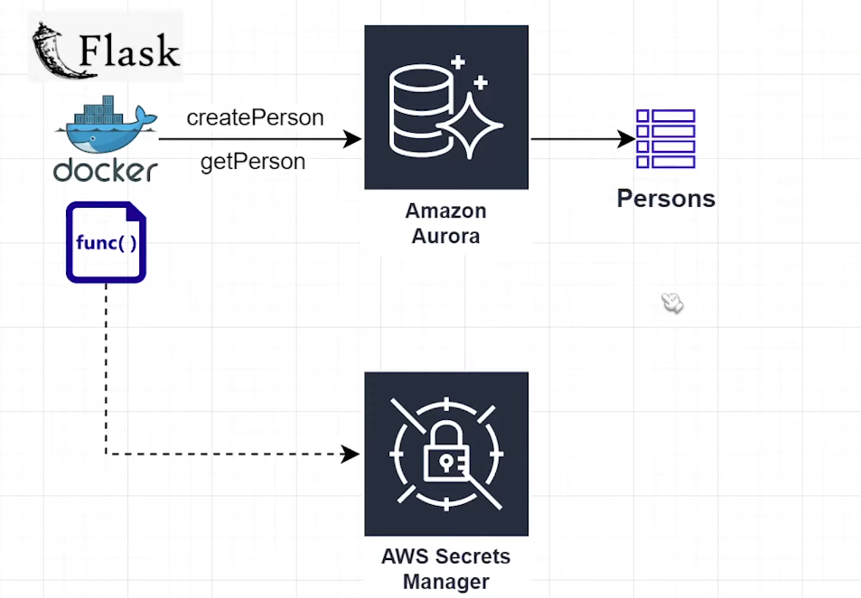
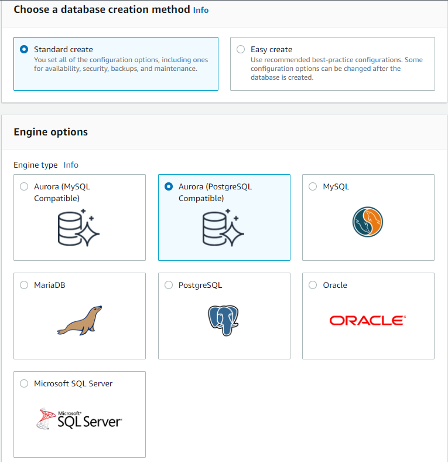
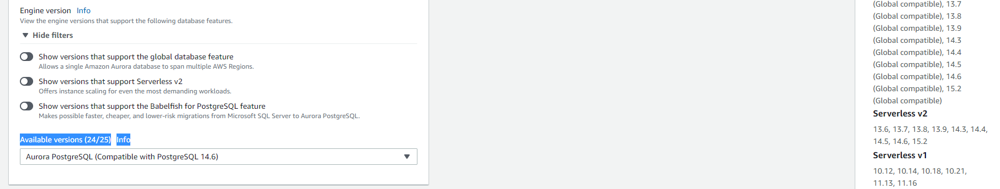
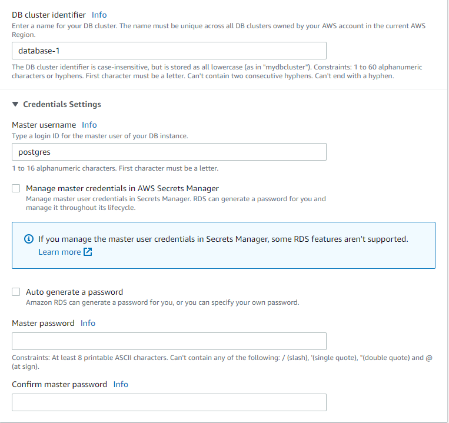

# Dockerize-Flask-App-with-Aurora-RDS
Create an application using Docker that communicates with an Aurora Serverless instance. This project will demonstrate how to set up your flask application, configure your docker file, create some apis, and link them to Aurora Serverless on AWS. 

## Table content
- System architect
- Config RDS and Secret Manager in AWS
- Code up the app
- Run Docker
- Result

### System architect

* So in the first phase, we will be building 2 APIs with GET/POST method that will interact with the Aurora RDS and then next up we will dockerize the app and run it on a container

### Config RDS and Secret Manager in AWS

*  Go to AWS Management console, find RDS service and create a database, in this project im choosing Aurora with postgreSQL compatible

*  Remember we will create a serverless application so choose the serverless V1 because it will support the DataAPI, i recommend the version 11.13
*  Under Connectivity, open the addition config and tick the DataAPI checkbox

*  Choose your databasename and password, we will be using it later 

*  Create a KMS for the RDS and a Secret Manager so we can access the RDS from outside 
### Code up the app
*  You can adopt the code i have provided in the app.py files

### Run Docker
*  After you code up the app.py build the dockerfile
*  Run docker build -t -flask-app .
*  docker run -d -p 8081:8081 flask-app

### Result
* Now you can open postman or any application call an GET/POST method 
Ex: http://localhost:8081/getPerson you pass the personId param 
